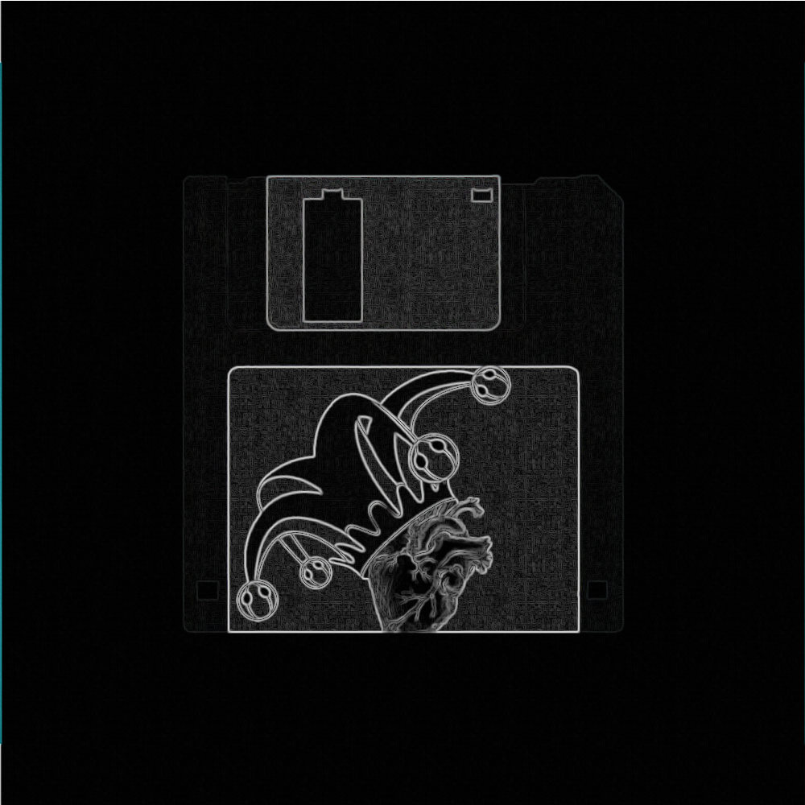

 <b> PerWorldPlugins </b> 

 <b> <a href="https://github.com/TheReal3rd/PerWorldPlugins/releases"> Releases </a> </b> 

 <b> Description: </b> 

 Allows the user to assign plugins to certain worlds for their minecraft server. 

 This is forked to remove unwanted and unneeded features. 

 This is for 0xJester private Minecraft server. 

 <b> Credits: </b> 

 1.TonimatasDEV (Main) 

 2. Third_Right (Da Forker) 
